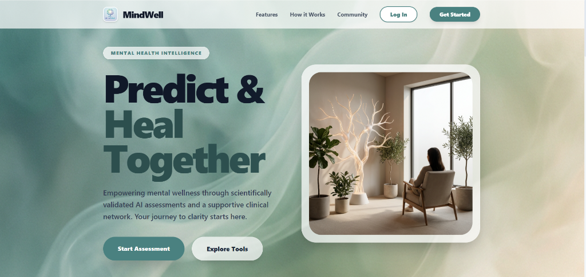
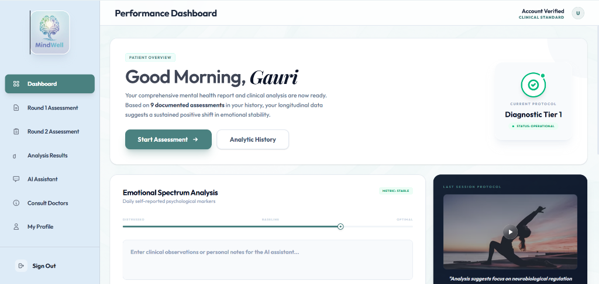
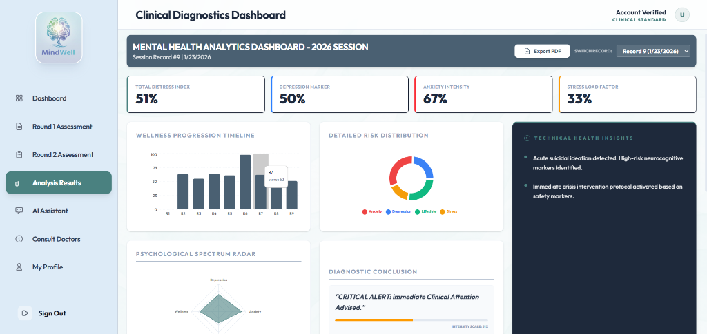
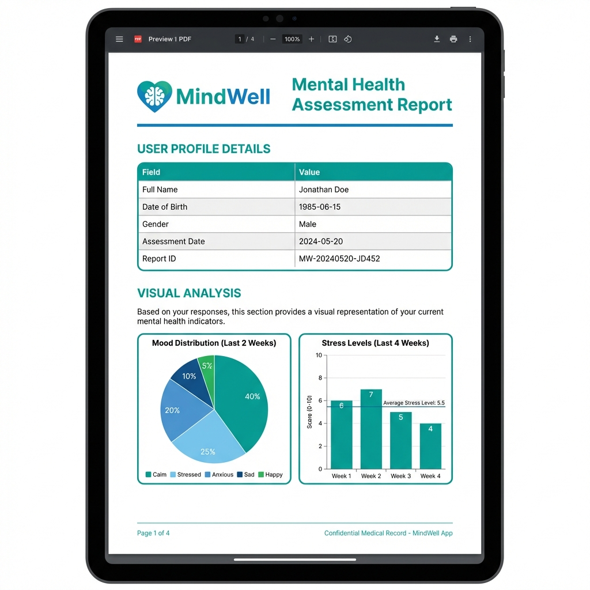

# MindWell - AI-Powered Mental Health Assessment Platform



**MindWell** is a comprehensive mental health tracking and assessment application designed to provide users with immediate, data-driven insights into their psychological well-being. By combining clinically validated assessment scales with advanced AI analysis, MindWell predicts potential mental health risks and offers personalized recommendations.

## 🚀 Key Features

*   **Scientific Assessments**: Two-stage assessment process (phq-9/gad-7 inspired) to evaluate depression, anxiety, stress, and overall wellness.
*   **AI-Driven Analysis**: Utilizes OpenAI/Groq API to interpret assessment data and generate a detailed "Climate Diagnostic Conclusion."
*   **Interactive Dashboards**:
    *   **User Dashboard**: Overview of assessment history and quick actions.
    *   **Analytics Dashboard**: Deep dive visual data including:
        *   **Wellness Progression Timeline**: Tracking scores over time.
        *   **Risk Distribution Pie Chart**: Visualizing the balance of mental health factors.
        *   **Psychological Spectrum Radar**: A holistic view of standard metrics.
*   **Clinical PDF Reports**: One-click generation of professional medical-grade PDF reports containing user profiles, scores, and high-fidelity charts for offline consultation.
*   **Secure Authentication**: Robust user registration and login system with JWT authentication.

## 📸 Application Snapshots

### Performance Dashboard
A personalized welcome screen providing a snapshot of the user's journey and quick access to assessments.


### Clinical Diagnostics
Deep analytical insights featuring interactive Recharts (Bar, Pie, Radar) and technical health insights generated by AI.


### Comprehensive PDF Exports
Users can download their data in a clean, professional format for sharing with healthcare providers.


## 🛠️ Technology Stack

**Frontend**
*   **React.js (Vite)**: Fast, modern UI library.
*   **Tailwind CSS**: Utility-first styling for a completely custom, responsive design.
*   **Recharts**: Composable charting library for React components.
*   **html-to-image & jsPDF**: Professional-grade PDF generation tools.
*   **Framer Motion**: Smooth animations and transitions.

**Backend**
*   **Node.js & Express**: High-performance REST API.
*   **PostgreSQL**: Reliable relational database for user and assessment data.
*   **OpenAI / Groq API**: The intelligence engine behind the qualitative analysis.
*   **JWT & BCrypt**: Industry-standard security for user data.

## ⚙️ Installation & Setup

1.  **Clone the Repository**
    ```bash
    git clone https://github.com/GauriTh06/mental-health.git
    cd mental-health-app
    ```

2.  **Environment Setup**
    Create a `.env` file in the `server` directory:
    ```env
    PORT=5000
    DATABASE_URL=your_postgres_connection_string
    JWT_SECRET=your_secure_random_string
    OPENAI_API_KEY=your_ai_api_key
    ```

3.  **Install Dependencies**
    ```bash
    # Install server dependencies
    cd server
    npm install

    # Install client dependencies
    cd ../client
    npm install
    ```

4.  **Run Application**
    You need to run both the client and server concurrently.

    *Terminal 1 (Server)*
    ```bash
    cd server
    npm run dev
    ```

    *Terminal 2 (Client)*
    ```bash
    cd client
    npm run dev
    ```

5.  **Access App**: Open your browser and navigate to `http://localhost:5173`.

## 🤝 Contributing

Contributions are welcome! Please feel free to submit a Pull Request.

---
*MindWell - Empowering mental wellness through technology.*
